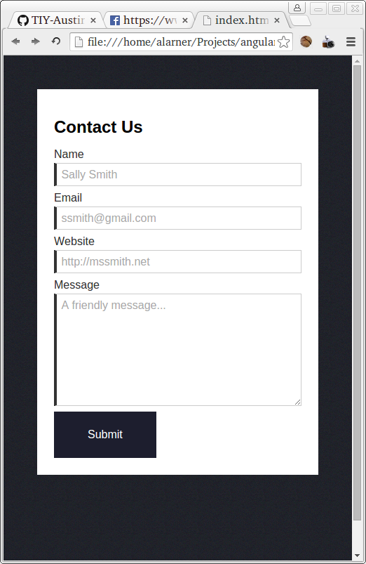
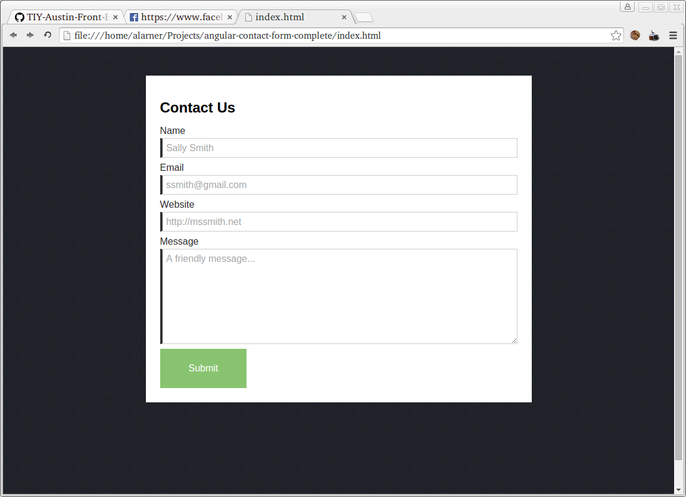
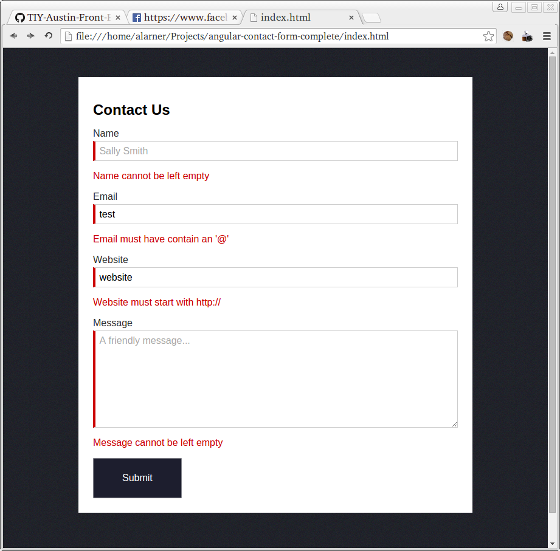
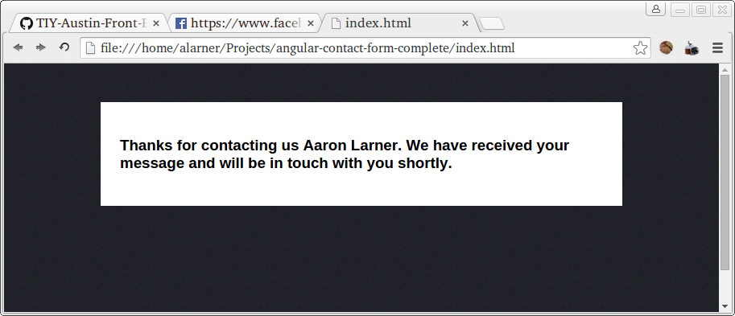

# Angular Contact Form

## Description
Angular Contact Form

## Objectives

### Learning Objectives

After completing this assignment, you should…

* Understand how to do form validation using angular models.
* Understand how angular dependencies are used within modules.

### Performance Objectives

After completing this assignment, you be able to effectively use

* ng-app
* ng-controller
* ng-submit
* ng-model
* ng-show
* ng-bind

## Details

### Deliverables

* A repo containing at least:
  * `index.html`
  * `scripts/app.js`
  * `scripts/controllers.js`
  * `images/bg.jpg`

### Requirements

* No JSHint warnings or errors

## Normal Mode
Create a contact form with the following fields: name, email, website and message. The form should also have a submit button. When the submit button is clicked (or the enter key is presses) it should validate all of the form fields and show *all* errors in the form data. Use CSS to style the form to be responsive. When you mouse over the submit button the background color should fade to a green color (#88C470) over the course of 0.5 seconds.

### Resources
* [Background Image](bg.jpg)

### Errors
* Name cannot be left empty
* Email cannot be left empty
* Email must contain an '@'
* Website cannot be left empty
* Website must start with http://
* Message cannot be left empty

### Mobile

### Desktop

### Error example

### Success page

## Hard Mode
Use $scope.$watch to validate the form as a user is typing in content. The form should show a red left border on the input element (but not any error text) if the input is invalid as the user is typing. Only after they click the submit button should it actually show the error messages.

## Notes
Hints:
* You'll want to use a series of models (bound to your input elements with ng-model) to keep track of all of the input data.
* You can use .indexOf(...) to check to see if a character appears within a string. Google it.
* You can use .substring(...) to look at a specific subsection of a string. This is useful for validating that the website starts with http://.
* Check out the css transition property for the submit button fading.
* You'll want to use a similar technique that you did with your [tabs assignment](https://github.com/TIY-Austin-Front-End-Engineering/angular-tabs) to switch the page after the form is successfully submitted.

<!-- ## Additional Resources

* Read 
 -->
