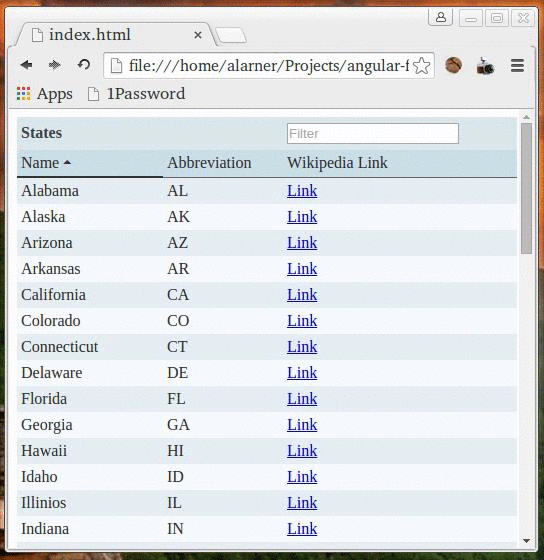

# Angular Fancy Table

## Description
Use angular to create a sortable, filterable data table of US states.

## Objectives

### Learning Objectives

After completing this assignment, you should…

* Be able to create a larger angular project that uses both ng-repeat directive and $http service.

### Performance Objectives

After completing this assignment, you be able to effectively use

* _.filter
* _.sortBy
* ng-app
* ng-controller
* ng-model
* ng-change
* ng-class
* ng-click
* ng-repeat
* ng-bind
* ng-href

## Details

### Deliverables

* A repo containing at least:
  * `index.html`
  * `scripts/app.js`
  * `scripts/controllers.js`
  * If you use yeoman than build your files (`gulp build`) and commit your dist directory to your completed repo.
  * Your repo should use .gitignore to remove bower_components

### Requirements

* No JSHint warnings or errors (other than ones related to angular)
* You must use _.filter and _.sortBy

## Normal Mode
Using the tools you've learned in class, create a sortable, filterable table of US states. The table should look and behave like the example below including showing and hiding arrows on the table headings indicating which direction the table is currently being sorted (and on which column). You should be able to type into the filter box and only show states that match the filter string on either the state name or abbreviation. Filtering on "tx" and "te" should both show Texas. The filtering should be case insensitive (both upper and lower case filter strings should work). You should use underscore or lodash methods to handle the filtering in your code.

## Hard Mode
If you're feeling adventurous, pull your states data from: http://tiny-pizza-server.herokuapp.com/collections/fancy-table

## Insane Mode
If you're feeling extra adventurous, use the Etsy API to pull your data instead of Tiny Pizza Server. In this case you don't have to pull in a list of states. Instead pull in a list of listings from Etsy with the following columns:

* Title
* Number of favorites
* Quantity
* Link to the listing on Etsy
            
## Notes
Hints: One way to do this is to store two copies of your states array. The first copy would contain the original list, and the second copy would be stored in a model (on the $scope variable). As the user interacts with your table by changing the sort order or filtering the data, you could use underscore ot lodash to filter and sort the original list, and store the result on your $scope variable (thereby updating the DOM). ng-repeat is necessary and my solution used all of the directives listed in the Performance Objectives section above.

## Additional Resources

* [_.filter](http://underscorejs.org/#filter)
* [_.sortBy](http://underscorejs.org/#sortBy)
