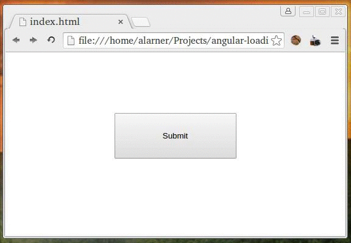

# Build a loading button with Angular

## Description
Using an angular controller and directive, build a button that becomes disabled when you click on it and changes its text to &quot;Loading...&quot; and then returns to its normal state after 4 seconds

## Objectives

### Learning Objectives

After completing this assignment, you should…

* Understand how angular $scope works within controllers and views.
* Know how to use directives and binding to react to user interactions.
* Understand the basics of Angular dependency injection.

### Performance Objectives

After completing this assignment, you be able to effectively use

* ng-bind
* ng-disabled
* ng-controller
* ng-click
* $timeout

## Details

### Deliverables

* A repo containing at least:
  * `index.html`
  * `scripts/controllers.js`
  * `bower.json`

### Requirements

* No JSHint warnings or errors

## Normal Mode
Replicate the following behavior using angular.

            

## Notes

Hints: create two variables on your controller scope called $scope.buttonText and $scope.isLoading. Use ng-bind to bind your buttonText to the button and ng-disabled to controll whether or not the button is disabled. You can use $timeout to reset the button back to its regular state after 4 seconds.

## Additional Resources

* You can use [angular-template](https://github.com/TIY-Austin-Front-End-Engineering/angular-template) to get started.
