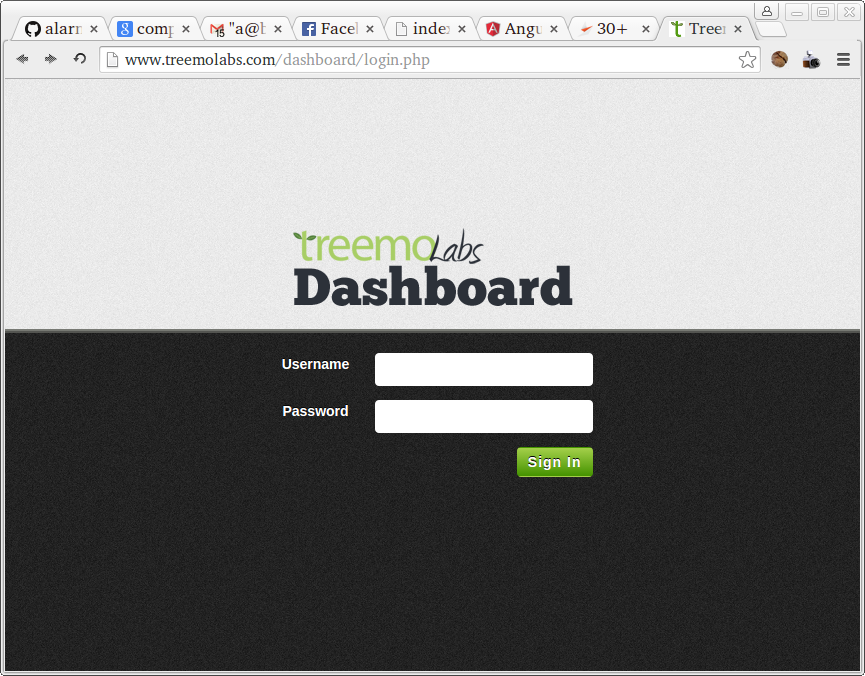

# Build a login form with Angular

## Description
Using an angular controller and directives, build a login form. The form should check to ensure that the username and password are filled in before checking to see if the username/password combination is in the list below.

## Objectives

### Learning Objectives

After completing this assignment, you should…

* Understand how do form validation in angular.
* Understand how to reference properties within a model inside of ng directives.

### Performance Objectives

After completing this assignment, you be able to effectively use

* ng-submit
* $window

## Details

### Deliverables

* A repo containing at least:
  * `index.html`
  * `scripts/controllers.js`
  * `bower.json`

### Requirements

* No JSHint warnings or errors

## Normal Mode
* The login form should display the following errors to the user if their input is invalid:
	* Please enter an email address before logging in.
	* Please enter a password before logging in.
	* Your user was not found.
	* The password you entered is incorrect.
* If the user logs in successfully they should be redirected to http://theironyard.com
* The email address field should not allow non-email address input.
* The password address field should have the letters obfuscated.
* The form should submit if the user types enter or clicks the submit button.
* Valid username / password combinations should be:
	* aaron@theironyard.com / password123
	* admin@google.com / pandas
	* <your email address> / honeycrisp

## Hard Mode
Style your login form to look like this:

The Logo used can be [found here](treemoLabs-logo.png). The background patterns can be found [here](bg-login-top.png) and [here](bg-login.png).

## Insane Mode
Use tiny pizza server (or sails) and jQuery to check the username and password combination against a list retreived from the server instead of from a hard coded list in the controller. Log each login attempt on the tiny pizza server for later lookup.

## Notes

Hints: For email address validation use the HTML5 type="email" attribute. To get the form to submit properly on enter and clicking submit use the ng-submit directive on wrapping form element.

## Additional Resources

* You can use [angular-template](https://github.com/TIY-Austin-Front-End-Engineering/angular-template) to get started.
