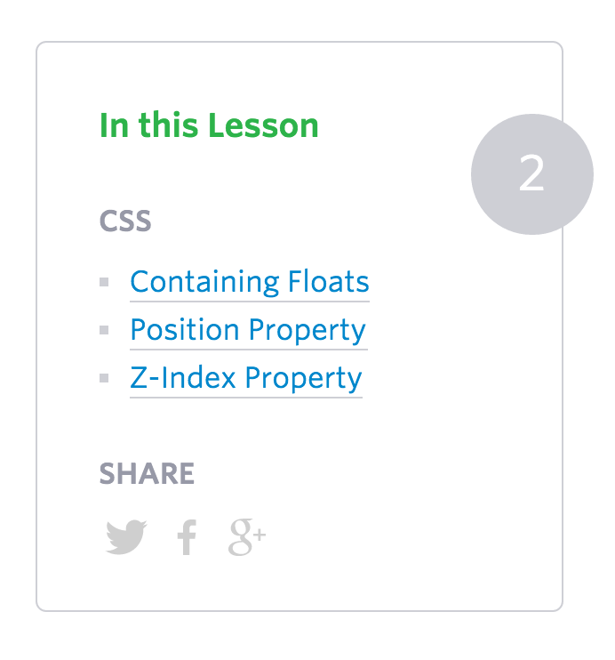

# Positioning Exercise

## Description

This exercise will test your knowledge of CSS positioning

## Objectives

### Learning Objectives

After completing this assignment, you should…

* Understand how CSS positioning works.

### Performance Objectives

After completing this assignment, you will be able to effectively use

* `position: relative;`
* `position: absolute;`
* `translate: transform(...)`

## Details

### Deliverables

* A project using basic broccoli build tools including
  - `index.html`
  - `app.css`


## Normal Mode

Recreate the following block using HTML and CSS with the build tools we learned today.



## Tasks

```
* [ ] Create a new Issue with these tasks!
* [ ] Use the `git` cli to initialize a new project
* [ ] Checkpoint: Created and committed boilerplate
* [ ] Use the `hub` cli to create a repository on Github
* [ ] Use the `git` cli to create a branch called `develop`
* [ ] In Github, open a PR _from_ `develop` _into_ `master`
* [ ] Checkpoint: Create the markup to represent the pictured site
  * [ ] Markup: "In This Lesson"
  * [ ] Markup: "CSS" List
  * [ ] Markup: "Share"
  * [ ] Markup: Number
  * [ ] Complete: Push `public/index.html`
* [ ] Add styles for page
  * [ ] Checkpoint: Style the Layout of the site
    * [ ] Style Main box
    * [ ] Style "In This Lesson"
    * [ ] Style "CSS" List
    * [ ] Style "Share"
    * [ ] Style Number
    * [ ] Complete: Push `public/index.html`
```
