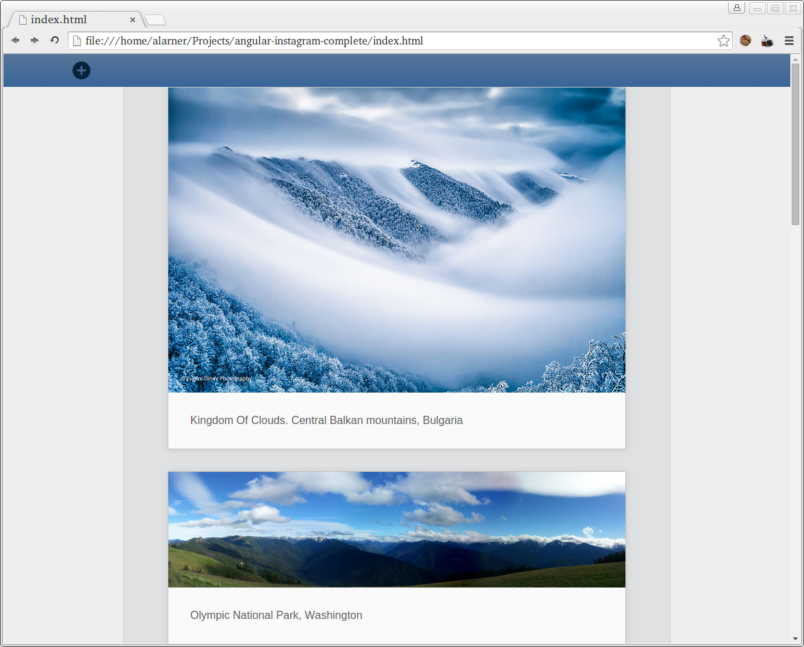

# angular-image-board

## Description
Create an image board that saves submissions to tiny pizza server using angular.

## Objectives

### Learning Objectives

After completing this assignment, you should…

* Be able to create a larger angular project that uses both ng-repeat directive and $http service.

### Performance Objectives

After completing this assignment, you be able to effectively use

* ng-repeat
* $http
* ng-controller
* ng-click
* ng-submit
* ng-bind
* ng-show
* ng-model

## Details

### Deliverables

* A repo containing at least:
  * `index.html`
  * `scripts/app.js`
  * `scripts/controllers.js`
  * If you use yeoman than build your files (`gulp build`) and commit your dist directory to your completed repo.
  * Your repo should use .gitignore to remove bower_components

### Requirements

* No JSHint warnings or errors

## Normal Mode
Using the tools you've learned in class, create a responsive image board that allows you to add images and captions via a url. The images that are added to the image board should be saved to tiny pizza server, so that when you reload the page, they are not lost. The form to add an image should properly validate the image URL by at minimum checking for a http:// or https:// prefix and require a non-empty description. Below are screenshots of what your app should look like.

### Mobile

### Desktop

### Add Image Form

### Desktop

### Add Image Form

## Notes
You'll want to create an array of objects on $scope in order to store your images. Use $http to load the images when the controller first runs, and then use post requests to add new images to tiny pizza server as they are added via your add image form. Form validation should be very similar to the angular-contact-form assignment. You can use [ionicons](http://ionicons.com) for the icons.

<!-- ## Additional Resources

* Read  -->
