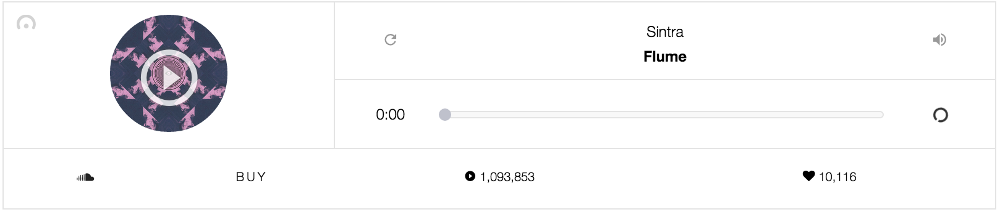

# react-soundcloud

## Description

Create a React Component that creates an interface for the Soundcloud SDK (https://developers.soundcloud.com/docs/api/sdks).

- The Soundcloud SDK will provide you access to searching for and streaming a Soundcloud song/sound.
- React will provide the UI and event handling surrounding the streaming feature.

Visual Inspiration:

## Objectives

### Learning Objectives

After completing this assignment, you should…

* Understand the difference in rednering techniques (React's Virtual DOM vs. Backbone's Views and templating)
* Understand how to handle a wide range of inputs and input events in React
* Understand 3d transforms, CSS animations, and form skinning

### Performance Objectives

After completing this assignment, you be able to effectively use

* React Components
* React Virtual DOM Events
* Soundcloud SDK
* A fair amount of HTML/SCSS control and animations

## Details

### Deliverables

* A publicly visible website (gh-pages, divshot, or heroku)

### Requirements

* No JSHint warnings or errors
* All specifications met below

## Easy Mode

- The React Component should render:
    - The author
    - The song/track name
    - A replay button
    - A volume button
    - A cropped/minified album cover image

## Normal Mode

In addition to Easy Mode:

- The React Component should render:
    - A counter for the number of times this track has been played on Soundcloud
    - A counter for the number of "loves" this track has received
    - A trackbar and progress for the song (elapsed time)
- When a song is streaming, the play button is a "pause" button.

## Hard Mode

In addition to Normal Mode:

- When a song is streaming, the trackbar and progress update with the elapsed time as a song plays
- If a user drags the progress indicator, the track will "scrub" with the user's interaction (i.e. dragging the indicator left will scrub backwards in time)

## Nightmare Mode

In addition to Hard Mode:

- Put a searchbar at the top of the screen, and as a user types in song names, render multiple search results as React Components in a grid beneath the search form.

> Check your notes and examples for pointers!!

<!-- 

## Notes

Notes go here...

## Additional Resources

* Read 
 -->